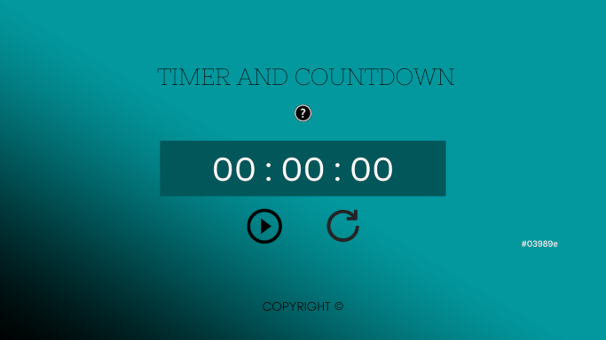

# Js-timer-countdown

A simple Javascript Timer and Countdown WebApp
   

    

## Sketch  

  

## Requirements:

- A play button that when clicked (or activated via space/enter) will check if there is any input in the time field and also will check if the timer is paused. If it exists and is not paused, it will start a countdown. If it does not exist and it is not paused, it will start a cumulative count up to 99:99:99 (hh:mm:ss format). If it is paused, it just turns into a continue button. When the countdown starts, it turns into a pause button.

- A restart button that will reset the timer.

- A pause button that will pause assign the paused status to the timer and stop counting.

- The small sound of a bell should be emitted when the count is completed.
   
  
## Timer Algorithm
   
It receives an input and transforms it into seconds, when the play button is activated it will use an intervalset function so that every second it increments or decrements the time value and displays it on the screen.
   
      
---
   
### To be done:

- [x] Layout with its proper CSS
- [ ] Interrogation button which displays instructions
- [x] Play/continue button which becomes a pause button
- [x] Pause button which becomes a play/continue button
- [x] Restart button which restarts the timer/page
- [ ] The timer functionalities (timer increase and countdown decrease)
- [ ] Correct the bug when it's reseted while its couting
