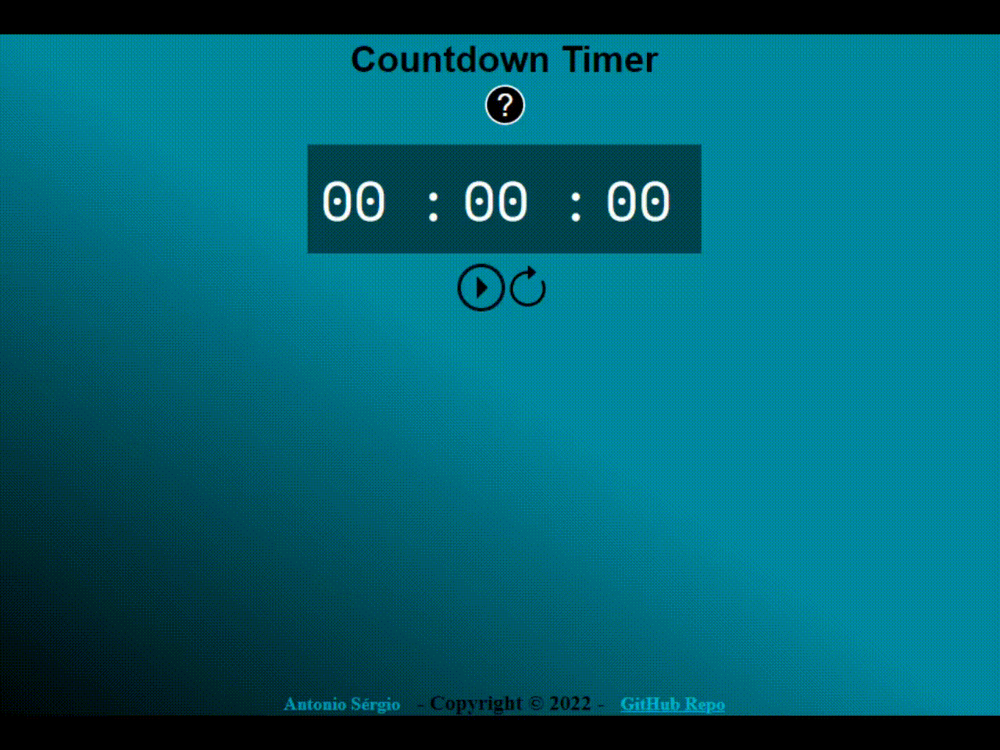

# Js-timer-countdown

A Countdown Timer webapp built using:
   

    

## Sketch  

  
   

## User instructions:

1. Enter a time in the format hh:mm:ss (e.g. 00:03:00 for 3 minutes) in the timer field above.
2. You can leave it blank (e.g 00:00:00) to an incremental counter timer.
3. Click in the "Play" button or press "Enter" in order to start, or resume the count.
4. Press "Enter" again to pause the countdown, or click the "Pause" button.
5. Keep in mind the incremental timer when paused and resumed will start a coutdown.
6. To reset the countdown, click the "Reset" button or press "Esc". This will reset the time to 00:00:00.
* Note: The timer will automatically stop when it reaches 0.

## Initial Requirements:

- A "Play" button that when clicked (or activated via an "Enter" pressed) will check if there is any input in the time field
and also will check if the timer is paused. If it exists and is not paused, it will start a countdown. If it does not exist 
(e.g 00:00:00) and the timer is not paused, it will start a cumulative count up to 99:59:59 (hh:mm:ss format).

- A "Pause" function and a "Resume" function.

- The buttons must change in the following way: when "Play" is pressed, it must become "Pause", when "Pause" is pressed, it 
must become a "Play" button.

- A "Reset" button that will reset the timer.

- The sound of a bell should be emitted when the count is completed.
   
  
## Timer Algorithm
   
- An object representing countdown time is created.

- It receives an input and transforms it into seconds, when the play button is activated, an intervalset function is used
to increment or decrement the time value by 1 second and display it on the screen at regular intervals.
   
      
---
   
### Extra Features:

* The "Enter" key now acts as a starter, resumer, and pauser button.

* I considered adding a countdown/incremental timer toggle, but it'd not meet original requirements. 
A boolean control variable could be created and passed as a condition in the start() method.
